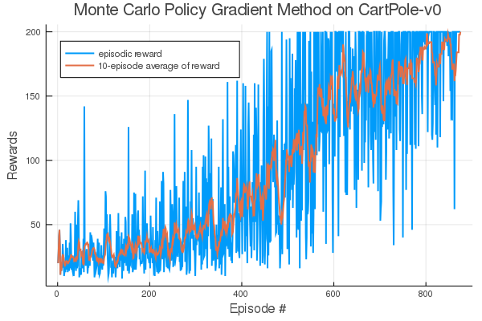

# Monte Carlo Policy Gradient using Flux.jl

This is an implementation of the Monte Carlo Policy Gradient method, also known as REINFORCE method, in [Julia](https://julialang.org) using the [Flux](https://github.com/Flux.jl) ML package. The algorithm has been tested on the CartPole-v0 environment.

## Results
### Rewards over episodes

 

### Initial untrained policy

### Final trained policy

